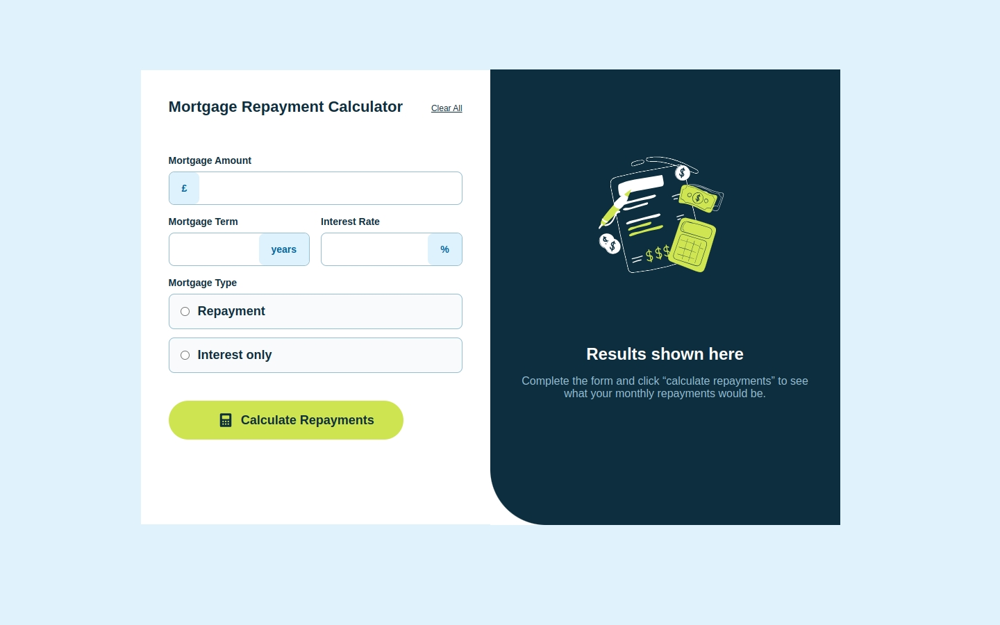

# Frontend Mentor - Mortgage repayment calculator solution

This is a solution to the [Mortgage repayment calculator challenge on Frontend Mentor](https://www.frontendmentor.io/challenges/mortgage-repayment-calculator-Galx1LXK73). Frontend Mentor challenges help you improve your coding skills by building realistic projects. 

## Table of contents

- [Overview](#overview)
  - [The challenge](#the-challenge)
  - [Screenshot](#screenshot)
  - [Links](#links)
- [My process](#my-process)
  - [Built with](#built-with)
  
- [Author](#author)

## Overview

### The challenge

Users should be able to:

- Input mortgage information and see monthly repayment and total repayment amounts after submitting the form
- See form validation messages if any field is incomplete
- Complete the form only using their keyboard
- View the optimal layout for the interface depending on their device's screen size
- See hover and focus states for all interactive elements on the page

### Screenshot

### Links

- Solution URL: [https://github.com/CoderAlchemy24/frm-mortgage-calculator.git](https://github.com/CoderAlchemy24/frm-mortgage-calculator.git)
- Live Site URL: [https://sparkling-bublanina-246a25.netlify.app/](https://sparkling-bublanina-246a25.netlify.app/)

## My process

### Built with

- [React](https://reactjs.org/) - JS library

## Author

- Website - [CoderAlchemy24](https://www.github.com/CoderAlchemy24)

